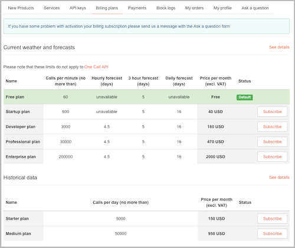
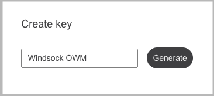
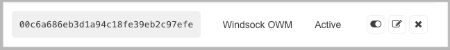
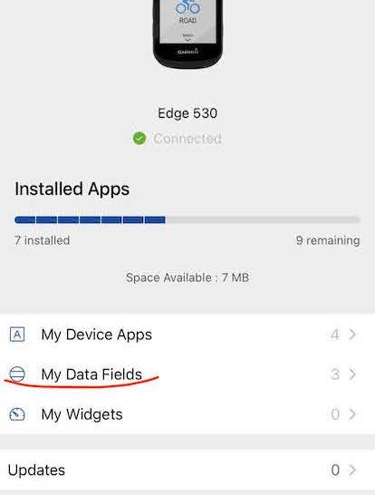
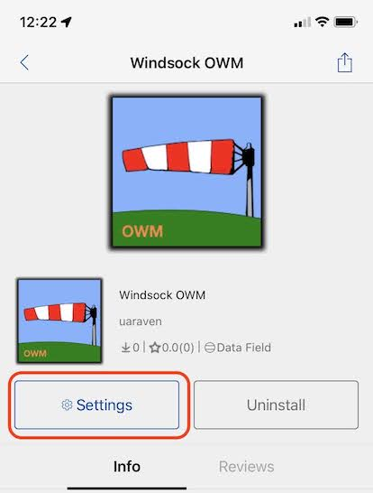
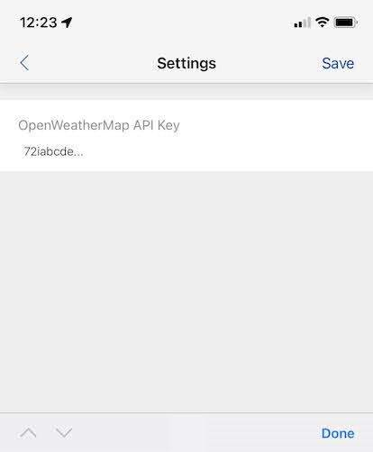

## Configuring Windosck OWM with OpenWeather API Key

You will need your own API key to use OpenWeather service. Obtaining one is free. Go to [OpenWeather](https://home.openweathermap.org/api_keys) website and create an account, then navigate to "API keys" tab.

You may want to double check that you're on Free plan in the "Billing plans" tab.

In the "Create key" input type the name of the key (Windsock OWM, or anything else you like) and click on "Generate" button.

_Don't use the key from the image above, it is invalid_.

Copy generated key from the web page

 and insert it into Windsock OWM configuration in Garmin Connect Mobile.

For this open Connect IQ app on the phone, select your Edge device and tap on "My Data Fields", select `Windsock OWM` in the list of datafields and tap on settings

 

 

Enter the API key and tap "Save"

