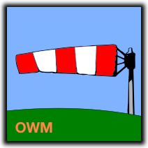

# Windsock OWM

 

Connect IQ data field which displays wind direction relative to the direction you're moving. Designed for the Edge head units.

This is an companion data field for [Windsock](https://github.com/uaraven/windsock) and it supports more devices and more accurate wind data, but 
requires more complex set up.

Windsock OWM requires Connect IQ 2.4 and higher and works* on following devices:
 
  - Edge 130
  - Edge 130+
  - Edge 520
  - Edge 520+
  - Edge 530
  - Edge 820
  - Edge 830
  - Edge 1000
  - Edge 1030
  - Edge 1030+
  - Edge Explore

Data field displays direction the wind is coming at you and wind speed (units depend on your device settings).

Arrow will change the color from green to red depending on the wind strength and direction, i.e. tailwind is always good(green) and light headwind is not a big deal either (green), but stronger headwind will be shown in orange or red (That obviously doesn't work on Edge 130).

The windsock data field uses OpenWeatherMap as weather provider, you will need to register an API key and configure Windsock OWM to use it.

The Windsock OWM requires Background, Communications and Positioning permissions to retrieve wind data in background from OpenWeatherMap.

## Configuration

You will need your own API key to use OpenWeather service. Obtaining one is free. Go to [OpenWeather](https://home.openweathermap.org/api_keys) website and create an account,
then navigate to "API keys" tab.

In the "Create key" input type the name of the key (Windsock OWM, or anything else you like) and click on "Generate" button.

Copy generated key and insert it into Windsock OWM configuration in Garmin Connect Mobile.

_Don't use the key from the image above, it is invalid_.

You may want to double check that you're on Free plan in the "Billing plans" tab.

## A note about correctness

At the beginning of the ride, there might be no wind data available or the wind data could be retrieved for the incorrect location (the last location where device was on). It may take from 1 to 5 minutes before Windsock OWM starts showing correct data. After that wind data is updated every 10 minutes.

Still, wind strength and direction shown by Windsock OWM may not reflect what you experience in the real life. Treat it as an approximate suggestion, not as the definite truth.

## License

Windsock OWM is an open source project and distributed under GPLv3 license. You can find the license in the [license.md](license.md) file

-----
\* should work, at least
